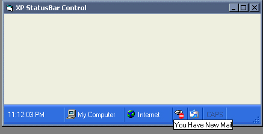



## xpWellsStatusBar

### Description

Sort of Emulates the Windows XP Statusbar
 
### More Info
 

             |
---                |---
**Submitted On**   |2003-02-08 23:01:16
**By**             |[Richard Wells](https://github.com/Planet-Source-Code/PSCIndex/blob/master/ByAuthor/richard-wells.md)
**Level**          |Intermediate
**User Rating**    |5.0 (65 globes from 13 users)
**Compatibility**  |VB 5\.0, VB 6\.0
**Category**       |[Custom Controls/ Forms/  Menus](https://github.com/Planet-Source-Code/PSCIndex/blob/master/ByCategory/custom-controls-forms-menus__1-4.md)
**World**          |[Visual Basic](https://github.com/Planet-Source-Code/PSCIndex/blob/master/ByWorld/visual-basic.md)
**Archive File**   |[xpWellsSta1566753312003\.zip](https://github.com/Planet-Source-Code/richard-wells-xpwellsstatusbar__1-44379/archive/master.zip)

